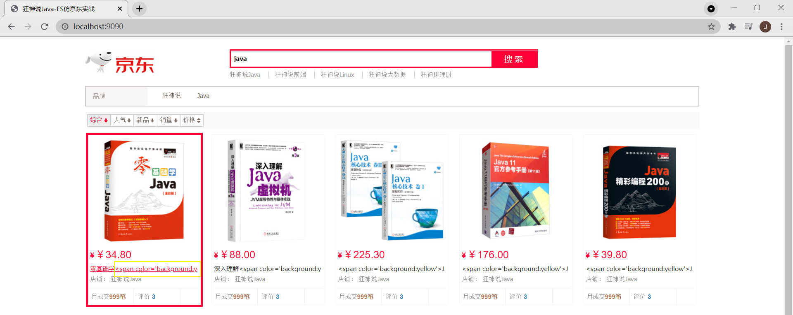

#### 案例：实现索引结果的高亮

IDE：IDEA

项目类型：spring boot

1.引入依赖 web，fast-json(将爬取下来的数据以 json 格式录入 es 索引中)，Jsoup，Thymeleaf

2.前提：基于 demo `kuangshen-es-jd-show` 。

3.应用启动后，访问 index 页面，解析一波 localhost:9090/parse/java (存入 es 索引) ，搜索 java，搜索结果中的关键词将得到高亮。

4.相对于前 demo，本 demo 将图书的 name 字段替换成了 title 字段，如果是之前版本的 demo，对应修改 2 个地方——①bean 类，② index.html 中的 result.xx。

效果图

高亮前：

高亮后：

前端解析前👆

前端解析后👇

[参考来源](https://www.bilibili.com/video/BV17a4y1x7zq?p=19)

