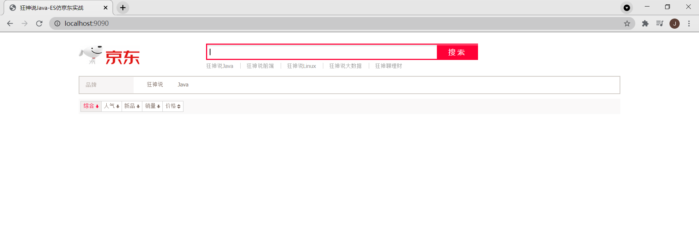
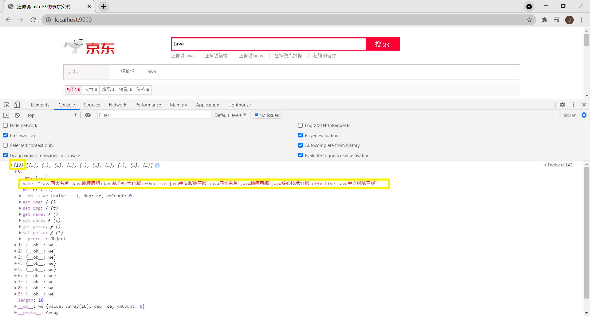

#### 案例：从 ES 索引中按标题搜索数据，并使用 vue 和 axios 提交回显到当前页面

IDE：IDEA

项目类型：spring boot

1.引入依赖 web，fast-json(将爬取下来的数据以 json 格式录入 es 索引中)，Jsoup，Thymeleaf

2.前提：基于 demo `kuangshen-es-jd` ，将 vue.js 和 axios.js 文件拷贝到 js 下，并在页面中引入。

3.应用启动后，访问 index 页面，打开控制台，输入任意关键字后，查看控制台日志信息——会发现数组内有 10 个值，观察页面前后变化。

4.如果遇到 Vue is not defined 可将 vue.js 引入行从后面放到 head 里优先加载。

效果图

[参考来源](https://www.bilibili.com/video/BV17a4y1x7zq?p=17)

[参考链接](https://blog.csdn.net/weixin_41796631/article/details/89214746)

